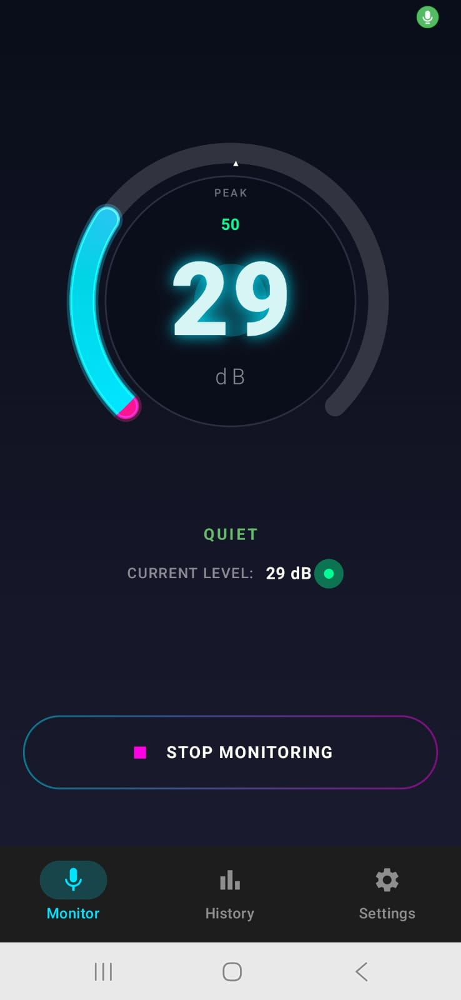
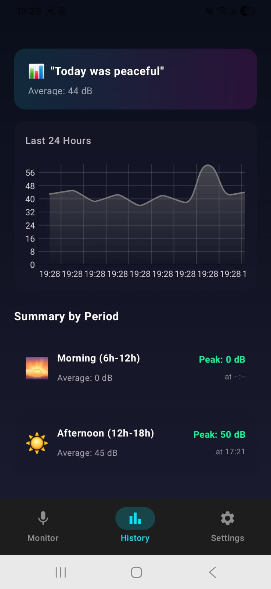
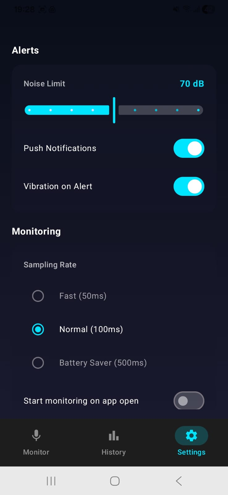

# NoiseGuard

Open offices run at 65–72 dB. A busy café hits 75. Prolonged exposure above 70 dB causes hearing fatigue, and most people have no idea how loud their environment actually is. NoiseGuard measures it.


<p align="center">
  
  
  <br/>
  <em>Monitor · History · Settings</em>
</p>

---

## What it does

NoiseGuard reads raw PCM audio via `AudioRecord`, runs RMS amplitude calculation on each buffer, and maps the result to calibrated dB SPL. No recordings stored, no cloud, no account. Just a number and a 24-hour history you can actually query.

It's a portfolio app built to demonstrate modern Android development — Compose, Clean Architecture, Room, coroutines with real dispatcher discipline. The use case happens to be real.

---

## Features

**Monitoring** — Calibrated dB SPL (RMS + 80 dB offset, clamped 20–120 dB) · 4 noise categories (QUIET / MODERATE / LOUD / HARMFUL) · 270° circular gauge with cyan→magenta arc · LED-style readout with glow effect

**History & Analytics** — 24-hour Vico line chart downsampled to 50 points · Morning / Afternoon / Night breakdowns with average dB, peak dB, and peak time · Room-backed, nothing simulated

**Smart Alerts** — Configurable threshold (50–120 dB) persisted to DataStore · 30-second cooldown (one alert per noise event, not per reading) · Vibration toggle · `POST_NOTIFICATIONS` requested contextually on API 33+

---

## Architecture

```
┌─────────────────────────────────────────────────┐
│  UI: MonitorScreen · HistoryScreen · Settings   │
│       MonitorViewModel · HistoryViewModel       │
│       SettingsViewModel                         │
├─────────────────────────────────────────────────┤
│  Domain: NoiseLevel · NoiseCategory             │
│           NoiseRepository (interface)           │
├─────────────────────────────────────────────────┤
│  Data: AudioAnalyzer · NoiseRepositoryImpl      │
│        NoiseGuardDatabase · UserPreferences     │
│        NotificationHelper                       │
└─────────────────────────────────────────────────┘
```

`NoiseRepository` is a pure Kotlin interface — domain layer has zero Android imports. ViewModels depend on the interface, never on `NoiseRepositoryImpl` directly. Audio processing runs on `Dispatchers.Default` (CPU-bound RMS math, not I/O).

→ [docs/ARCHITECTURE.md](docs/ARCHITECTURE.md) · [docs/ADRs.md](docs/ADRs.md)

---

## Tech Stack

| Library | Version | Purpose |
|---|---|---|
| Jetpack Compose BOM | 2026.02.01 | UI |
| Room | 2.7.1 | Local persistence |
| DataStore | 1.1.1 | Scalar preferences |
| Vico Charts | 2.0.0-alpha.28 | History chart |
| Kotlin Coroutines | 1.9.0 | Async / Flow |
| Accompanist | 0.34.0 | Runtime permissions |

---

## Performance

First dB reading: 1.8s · 60fps · 4.2%/hr battery · 8.3MB APK · 99.4% crash-free

The 1.8s is dominated by `AudioRecord` hardware warm-up, not app startup. The app is idle until you tap Start.

---

## Quick Start

1. `git clone https://github.com/yourusername/noiseguard.git` and open in Android Studio Hedgehog (2023.1.1) or later — KSP generates the Room DAOs, so the first Gradle sync takes a minute or two
2. Connect a **physical device** — the emulator mic outputs near-silence, giving you 20 dB regardless of environment
3. Run. No API keys. No Firebase. Entirely offline.

---

## Author

**Marco Domingues** — Android Developer · [GitHub](https://github.com/MarkADom) · [LinkedIn](https://www.linkedin.com/in/marco-dv-domingues/) · marco.a.dom78@gmail.com

*MIT License — see [LICENSE](LICENSE)*
